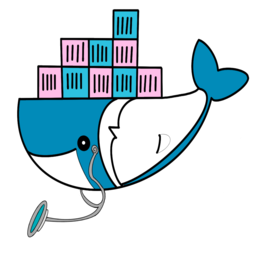
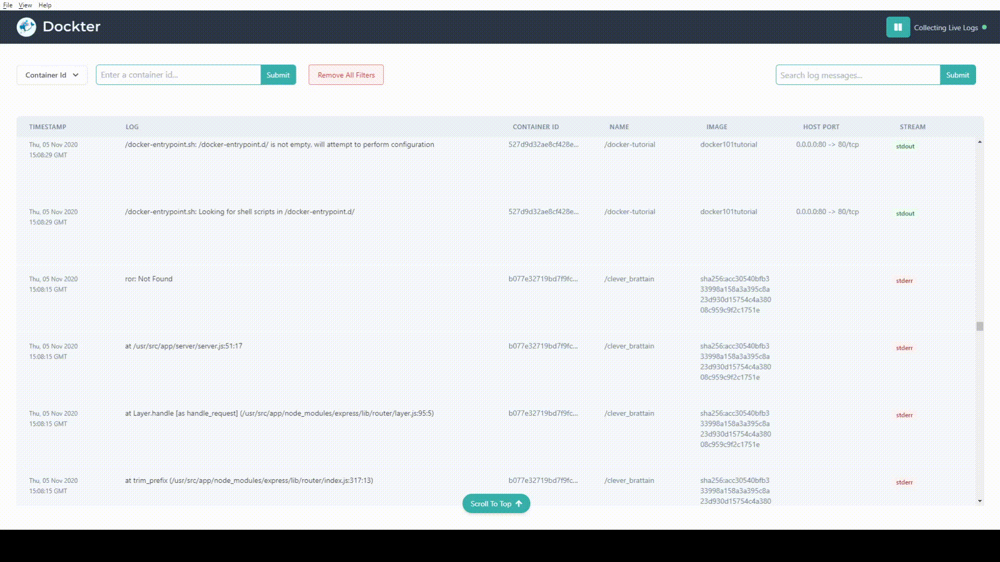

<p align="center">
  
</p>

<p align="center">
  
  
  
    
</p>

# Appendix

[_What is Dockter_](#overview)  
[_Companion Website_](#companion-website)  
[_Prerequisites_](#prerequisites)  
[_Quick Start_](#quick-start)  
[_Built With_](#built-with)  
[_Contributions_](#contributions)  
[_Testing_](#testing)  
[_Authors_](#authors)  
[_Beta_](#beta)

# What is Dockter?

> Dockter v1.0 is a low-overhead , open source Docker log management tool built around:
>
> - **Real-time Log Aggregation** - communications with the Docker Engine API allows us the ability to wrangle container streams and translate those chunks into readable data that can be viewed on an intuitve dashboard
>
> 
>
> - **Efficient Storage** - with the power of Electron, Dockter provides users with the ability to store container logs on their local disk storage (shared database storage is in the works!)
>
> 
>
> - **Search Capability** - container debugging has never been easier thanks to Dockter's snappy filter, sort, and search features
>
> 

# Companion Website

> - [Dockter.io](https://www.dockter.io/)
> - [Give us some claps on medium!](https://kylewhang.medium.com/a-remedy-for-containerized-illness-f9d0c5e49f6)

# Prerequisites

> Ensure that you have the following installed and running on your machine:
>
> - [Docker Client](https://www.docker.com/get-started)
> - [Running Docker Container(s)](https://docs.docker.com/get-started/)
> - [Yarn Package Manager](https://classic.yarnpkg.com/en/docs/getting-started)

# Quick Start

> First, clone our repo by running either:
>
> ```
> git clone git@github.com:oslabs-beta/Dockter.git
> ```
>
> _or_
>
> ```
> gh repo clone oslabs-beta/Dockter
> ```
>
> (_if you have the [Github CLI](https://cli.github.com/) installed_)
> in your terminal.
> Next, `cd` into your cloned Docktor repository and run the following command to install all necessary dependencies
>
> ```
> yarn
> ```
>
> Last, run this command to start Dockter on your machine. It's as easy as that!
>
> ```
> yarn start
> ```

# Built With

> - Docker - Platform as a Service
> - React (Hooks) - Front-end Library
> - Electron - Desktop Application Framework
> - Tailwind CSS
> - MongoDB - noSQL Document Oriented database
> - Mongoose - Object Data Modeling Library
> - Jest - Testing Framework
> - Enzyme - React Testing Utility
> - ESlint - Javascript Linting Tool
> - Yarn - Package Manager

# Contributions

> Dockter welcomes any ideas and/or contributions to its codebase. Please click the button below to reach out to us at with any questions or even if you'd just like to talk shop. We'd love to hear from you!  
>  <br> > _To run the application in development mode, please clone the Docktor repository to your local machine and run the following commands in your terminal:_
>
> ```
> yarn
> ```
>
> ```
> yarn dev
> ```
>
>    <br>
> <p align="center">
> <a href="mailto:dockter.contributions@gmail.com?subject=Contribution Requests or Question"></a>
> </p>

# Testing

_To perform tests on the Dockter codebase, please clone the repository to your local machine and run the following commands in your terminal:_

> ```
> yarn
> ```
>
> ```
> yarn build
> ```
>
> ```
> yarn test
> ```

# Authors

Benjamin Brower [@github](https://github.com/bbrower21) [@linkedIn](https://www.linkedin.com/in/ben-brower-80660073/)  
Anup Ramdass [@github](https://github.com/anrax) [@linkedIn](https://www.linkedin.com/in/anupramdass/)  
Nancy Koushoult [@github](https://github.com/noodlemonkey) [@linkedIn](https://www.linkedin.com/in/nancy-kousholt-a6a2071b9/)  
Kyle Whang [@github](https://github.com/shaisle) [@linkedIn](https://www.linkedin.com/in/kylewhang/)  
Samuel Kim [@github](https://github.com/samuy) [@linkedIn](https://www.linkedin.com/in/whalewhalewhale/)

# Features In Beta

_The Dockter team is dedicated to working around the clock to ensure proper maintainence and the addition of even more robust features. The following are coming soon:_

> - Analysis and Container Metrics - real-time containers statistics will be available to the user on the Dockter dashboard in a visualized format with the capability to dynamically focus on logs that may require higher levels of oversight
> - Container management - users will be able to remove, stop, and start containers from within the Dockter dashboard
